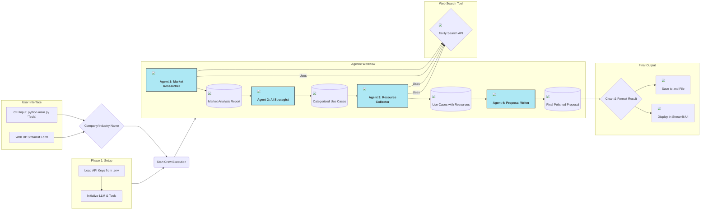

# 🤖 GenAI Multi-Agent Proposal System

This project is a sophisticated multi-agent system designed to automatically generate in-depth AI/GenAI use case proposals for any given company or industry. The system leverages a crew of specialized AI agents, each performing a distinct task in a sequential workflow, from initial market research to the final, polished proposal document.

This project was built to fulfill the requirements of the **Generative AI Engineer Assignment**.

---

## ✨ Features

- **Multi-Agent System**: Utilizes a 4-agent crew (Researcher, Strategist, Collector, Writer) for a structured, assembly-line workflow.
- **Dynamic Input**: Can analyze any company or industry provided as input.
- **In-Depth Analysis**: Conducts market research, identifies competitors, and finds official company statements on technology strategy.
- **Creative Ideation**: Generates a diverse portfolio of AI use cases, categorized by strategic impact.
- **Feasibility Check**: Finds relevant public datasets and open-source code repositories for each use case.
- **Professional Reporting**: Compiles all findings into a polished, executive-ready proposal in markdown format.
- **Dual Interface**: Can be run as a command-line tool or as an interactive Streamlit web application.

---

## 🏛️ Architecture Overview

The system is built on a sequential multi-agent architecture where the output of one agent becomes the input for the next. This ensures a logical flow of information and builds a comprehensive final report step-by-step.



---

## 🛠️ Technology Stack

- **Agent Framework**: CrewAI
- **LLM**: Google Gemini (via `crewai`)
- **Web Search Tool**: Tavily Search API
- **Web Application**: Streamlit
- **Core Language**: Python

---

## 🚀 Setup and Installation

Follow these steps to set up and run the project locally.

### 1. Clone the Repository
```bash
git clone [https://github.com/your-username/your-repo-name.git](https://github.com/your-username/your-repo-name.git)
cd your-repo-name
```

### 2. Create a Virtual Environment
```bash
python -m venv venv
source venv\bin\activate  # On Windows, use `venv\Scripts\activate`
```

### 3. Install Dependencies
Install all the required libraries from the `requirements.txt` file.
```bash
pip install -r requirements.txt
```

### 4. Set Up Environment Variables
Create a file named `.env` in the root directory and add your API keys.

**`.env` file:**
```env
# Get from Google AI Studio
GOOGLE_API_KEY="YOUR_GEMINI_API_KEY_HERE"

# Get from Tavily AI
TAVILY_API_KEY="YOUR_TAVILY_API_KEY_HERE"
```

---

##  usage

This application can be run in two ways:

### 1. Command-Line Interface (CLI)

The `main.py` script allows you to generate a proposal directly from your terminal. Pass the company or industry name as an argument.

**Examples:**
```bash
# Analyze a single company
python main.py "NVIDIA"

# Use quotes for names with spaces
python main.py "The Coca-Cola Company"

# Analyze an entire industry
python main.py "The Global E-commerce Sector"
```
The final report will be saved as a `.md` file in the project directory.

### 2. Streamlit Web Application

The `app.py` script launches an interactive web interface.

**To run the app:**
```bash
streamlit run app.py
```
This will open a new tab in your browser. Enter a company name in the sidebar and click "Generate Proposal" to see the results on the page and get a download link.
